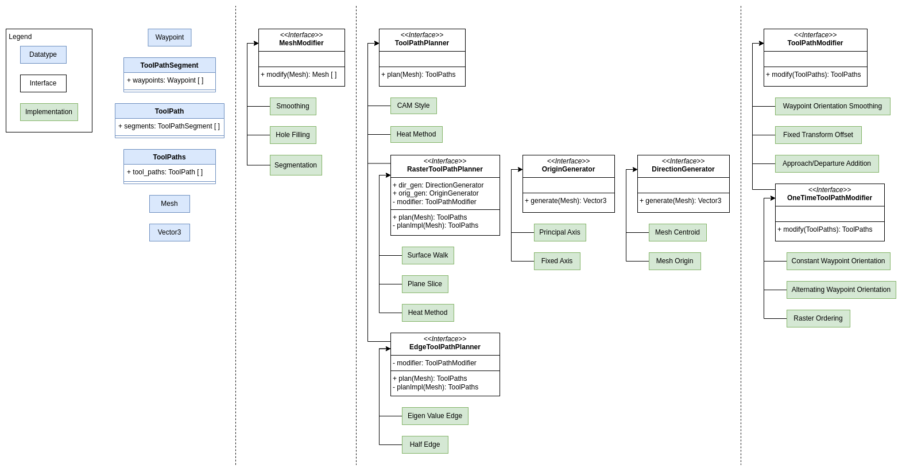

# Noether

[](http://rosindustrial.org/news/2016/10/7/better-supporting-a-growing-ros-industrial-software-platform)

## Build Status

Platform             | CI Status
---------------------|:---------
Ubuntu Focal         | [](https://github.com/ros-industrial/noether/actions)
Ubuntu Jammy         | [](https://github.com/ros-industrial/noether/actions)
Lint  (Clang-Format) | [](https://github.com/ros-industrial/ros-industrial/actions)

## Description
This repository provides software for performing tool path planning on arbitrary mesh surfaces.
We define tool path planning as the generation of an ordered set of waypoints for a robotic process (e.g., painting, sanding, inspection, routing, etc.) based on some input geometry.
The idea is that the tool of the robot should traverse through this set of waypoints in order to accomplish the desired task.

We think of the tool path planning process as a pipeline consisting of 3 steps:
1. Mesh modification
    - Often input geometry (specifically meshes) does not actually reflect the surface from which we want to generate tool paths.
    Usually we want to process the mesh in various ways, such as smoothing, segmentation, or primitive fitting and projection.
1. Tool path planning
    - This is the generation of waypoints directly from the modified mesh(es).
    Planners generally create waypoints directly on the surface of the input modified mesh(es).
1. Tool path modification
    - Many robot processes require application specific changes or additions to a tool path. 
    These include operations like order reorganization, pose offsets, approaches/departures, etc.
    Instead of building these changes directly into customized tool path planners, we implement them as a separate step in the pipeline.

## GUI
This project provides a GUI application for use of the provided tool path planning utilities.
Load an arbitrary mesh, configure your desired tool path planning pipeline, and experiment with different types of planners and modifiers.
The generated tool path can then be saved to a YAML file for use in other applications.


## Architecture

### Structure


### Interfaces
This repository provides three key abstract interfaces to facilitate the tool path planning pipeline:
- **[`MeshModifier`](noether_tpp/include/noether_tpp/core/mesh_modifier.h)**
  - Takes an mesh and returns a vector of modified meshes
  - Implementation examples include primitive fitting and projection, region of interest selection, smoothing, hole filling, etc.
- **[`ToolPathPlanner`](noether_tpp/include/noether_tpp/core/tool_path_planner.h)**
  - Takes an input mesh and produces a tool path
  - This repository also provides two sub-interfaces for planners with more specific behavior:
    - [`RasterPlanner`](noether_tpp/include/noether_tpp/tool_path_planners/raster/raster_planner.h)
    - [`EdgePlanner`](noether_tpp/include/noether_tpp/tool_path_planners/edge/edge_planner.h)
  - Implementation examples include plane slice raster planner, CAM style planner, mesh half-edge planner
- **[`ToolPathModifier`](noether_tpp/include/noether_tpp/core/tool_path_modifier.h)**
  - Takes an tool path and produces a modified tool path
  - Implementation examples include order reorganization, orientation smoothing, approach/departure addition, pose offset, etc.

See the [`noether_tpp` documentation](noether_tpp/README.md) for more details on the architecture of the package.

### Customization
Custom behavior can be added by providing a class that overrides one of the interface classes.
See the implementations in the [`mesh_modifiers`](noether_tpp/include/noether_tpp/mesh_modifiers), [`tool_path_planners`](noether_tpp/include/noether_tpp/tool_path_planners), and [`tool_path_modifiers`](noether_tpp/include/noether_tpp/tool_path_modifiers) for reference.

See the [`noether_gui` documentation](noether_gui/README.md) for more details on how to a GUI plugin for a custom implementation of one of the interfaces.

## Build
Nominally, this project is ROS-independent, but it is convenient to use the ROS dependency management and build tools to build the repository.

Clone the repository into a workspace, download the dependencies, and build the workspace.

```commandLine
cd <ws>
vcs import src < dependencies.repos
rosdep install --from-paths src -iry
<colcon/catkin> build
```
