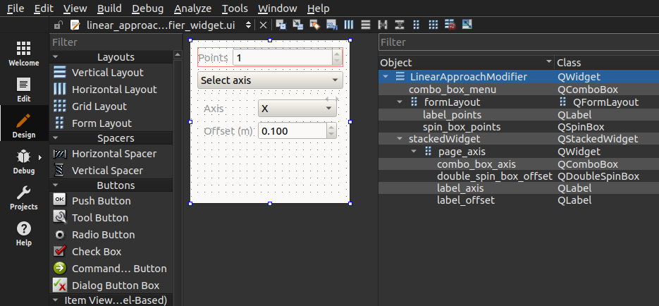

# Noether GUI


## Architecture


## Tutorial: Creating a GUI Plugin for Custom Implementations of Noether Interfaces

The following tutorial aims to guide new Noether users how to create a GUI plugin for a custom implementation of a Noether interface. We describe widget creation in more detail to assist users unfamiliar with the [Qt framework](https://doc.qt.io/). 

We will describe how we created a [`ToolPathModifier`](https://github.com/ros-industrial/noether/blob/dev/noether_tpp/include/noether_tpp/core/tool_path_modifier.h) called the [`LinearApproachModifier`](https://github.com/ros-industrial/noether/blob/dev/noether_tpp/include/noether_tpp/tool_path_modifiers/linear_approach_modifier.h). 

This toolpath modifier inserts a user-specified number of waypoints to the first waypoint of a toolpath segment that are equally spaced within a defined offset from the first waypoint.     

The concepts described for the `ToolPathModifier` are also relevant to the `MeshModifier` and `ToolPathPlanner` interfaces. 

In places where `ToolPathModifier` is written in the code, this can be replaced with `MeshModifier` or `ToolPathPlanner` if creating a custom `MeshModifier` or `ToolPathPlanner` interface respectively. 

Refer to existing [`MeshModifier`](https://github.com/ros-industrial/noether/tree/dev/noether_tpp/include/noether_tpp/mesh_modifiers) and [`ToolPathPlanner`](https://github.com/ros-industrial/noether/tree/dev/noether_tpp/include/noether_tpp/tool_path_planners) implementations for more examples. 

The `LinearApproachModifierWidget` looks like this in the Noether GUI Application. 


When the combobox widget with the option "Select Axis" is changed to "Define Axis", the application looks like this.


An example toolpath plan in the Noether GUI Application is shown below with three points offset 0.1 meters in the Z axis from the first waypoints of the segments of the toolpath.


### Files to Create/Modify
When creating a new GUI plugin, you will need to create the following files: 

[`noether_gui`](https://github.com/ros-industrial/noether/tree/dev/noether_gui)
- [noether_gui/src/widgets/tool_path_modifiers/linear_approach_modifier_widget.ui](https://github.com/ros-industrial/noether/blob/dev/noether_gui/src/widgets/tool_path_modifiers/linear_approach_modifier_widget.ui) (If using Qt Designer to create widget format, this XML file is autogenerated from the Qt Designer, otherwise this is optional)
- [noether_gui/include/noether_gui/widgets/tool_path_modifiers/linear_approach_modifier_widget.h](https://github.com/ros-industrial/noether/blob/dev/noether_gui/include/noether_gui/widgets/tool_path_modifiers/linear_approach_modifier_widget.h)
- [noether_gui/src/widgets/tool_path_modifiers/linear_approach_modifier_widget.cpp](https://github.com/ros-industrial/noether/blob/dev/noether_gui/src/widgets/tool_path_modifiers/linear_approach_modifier_widget.cpp)

[`noether_tpp`](https://github.com/ros-industrial/noether/tree/dev/noether_tpp)
- [noether_tpp/include/noether_tpp/tool_path_modifiers/linear_approach_modifier.h](https://github.com/ros-industrial/noether/blob/dev/noether_tpp/include/noether_tpp/tool_path_modifiers/linear_approach_modifier.h)
- [noether_tpp/src/tool_path_modifiers/linear_approach_modifier.cpp](https://github.com/ros-industrial/noether/blob/dev/noether_tpp/src/tool_path_modifiers/linear_approach_modifier.cpp)

The following files need to be modified:
- [noether_gui/src/plugins.cpp](https://github.com/ros-industrial/noether/blob/dev/noether_gui/src/plugins.cpp)
- [noether_tpp/CMakeLists.txt](https://github.com/ros-industrial/noether/blob/dev/noether_tpp/CMakeLists.txt)
- [noether_gui/CMakeLists.txt](https://github.com/ros-industrial/noether/blob/dev/noether_gui/CMakeLists.txt)

**Note:** The files listed above already exist for the `LinearAppoachModifier`. The names of the files and object names within each file will need to be renamed to the name of your custom interface.

The main components of each of these files will now be discussed.

### [Qt Designer .ui File](https://github.com/ros-industrial/noether/blob/dev/noether_gui/src/widgets/tool_path_modifiers/linear_approach_modifier_widget.ui)
The XML file linked above is automatically generated by the Qt Designer ([Qt Designer Manual](https://doc.qt.io/qt-6/qtdesigner-manual.html)). It is not advised to create or edit this XML file by hand. 
New Qt users will likely find creating and editing widgets easier in the Qt Designer, while more advanced Qt users may find a mix using the Qt Designer and programatically creating widgets more convenient. 

If using the Qt Creator IDE, you have the option of the IDE automatically generating the .ui, the header, and the source files for your widget.

The `linear_approach_modifier_widget.ui` looks like this in the QtDesigner:


The `Vector3dEditor` widget is also used in the `LinearApproachToolPathModifierWidget` and appears like this in the Qt Designer:

 
The column on the left shows the various Qt objects that can be arranged in the center GUI editor of the application. The right column lists the Qt objects, the object names, and the classes the objects belong to.  

### [Header File for `ToolPathModifierWidget`](https://github.com/ros-industrial/noether/blob/dev/noether_gui/include/noether_gui/widgets/tool_path_modifiers/linear_approach_modifier_widget.h)
``` cpp
#pragma once

#include <noether_gui/widgets.h>
#include <noether_tpp/core/tool_path_modifier.h>

namespace Ui
{
class Vector3dEditor;
class LinearApproachModifier;
}  // namespace Ui

namespace noether
{
class LinearApproachToolPathModifierWidget : public ToolPathModifierWidget
{
public:
  LinearApproachToolPathModifierWidget(QWidget* parent = nullptr);

  ToolPathModifier::ConstPtr create() const override;

  void configure(const YAML::Node&) override;
  void save(YAML::Node&) const override;

protected:
  Ui::LinearApproachModifier* ui_;
  Ui::Vector3dEditor* vector_editor_ui_;
};

}  // namespace noether
```

The header file for the widget declares the QT creator UI elements (under the Ui namespace) and the Noether `ToolPathModifierWidget` class methods. 

The `ui_` and `vector_editor_ui` pointers have access to the data for the objects defined in the autogenerated header file that the Qt Designer makes once the .ui file is complied. These are included by the lines in the [source code](https://github.com/ros-industrial/noether/blob/dev/noether_gui/src/widgets/tool_path_modifiers/linear_approach_modifier_widget.cpp) file below.
``` cpp
#include "../ui_vector3d_editor_widget.h"
#include "ui_linear_approach_modifier_widget.h"
```

The `LinearApproachToolPathModifierWidget` inherits from the `ToolPathModifierWidget` class. The `ToolPathModifierWidget` class inherits from the `BaseWidget` class which inherits from the Qt `QWidget` class. 

The `BaseWidget` class can produce a widget class of [specifiable type](https://github.com/ros-industrial/noether/blob/dev/noether_gui/include/noether_gui/widgets.h).   

### [Source Code for `ToolPathModifierWidget`](https://github.com/ros-industrial/noether/blob/dev/noether_gui/src/widgets/tool_path_modifiers/linear_approach_modifier_widget.cpp)
``` cpp
#include <noether_gui/widgets/tool_path_modifiers/linear_approach_modifier_widget.h>
#include <noether_gui/utils.h>

#include <noether_tpp/tool_path_modifiers/linear_approach_modifier.h>
#include "../ui_vector3d_editor_widget.h"
#include "ui_linear_approach_modifier_widget.h"
#include <yaml-cpp/yaml.h>

static const std::string N_POINTS_KEY = "n_points";
static const std::string X_KEY = "x";
static const std::string Y_KEY = "y";
static const std::string Z_KEY = "z";
static const std::string AXIS_KEY = "axis";
static const std::string OFFSET_KEY = "offset";

namespace noether
{
LinearApproachToolPathModifierWidget::LinearApproachToolPathModifierWidget(QWidget* parent)
  : ToolPathModifierWidget(parent), ui_(new Ui::LinearApproachModifier()), vector_editor_ui_(new Ui::Vector3dEditor())
{
  ui_->setupUi(this);

  // Add a page to the stacked widget for the axis editor
  auto page_vector = new QWidget(this);
  vector_editor_ui_->setupUi(page_vector);
  vector_editor_ui_->group_box->setTitle("Axis");
  ui_->stackedWidget->addWidget(page_vector);

  // Connect the button to toggle between the axis selector and axis editor
  connect(ui_->combo_box_menu, qOverload<int>(&QComboBox::currentIndexChanged), [this](int index) {
    ui_->stackedWidget->setCurrentIndex(index);
  });

  // Set to z-axis by default
  ui_->combo_box_axis->setCurrentIndex(2);
}

ToolPathModifier::ConstPtr LinearApproachToolPathModifierWidget::create() const
{
  if (ui_->combo_box_menu->currentIndex() == 0)
  {
    auto axis = static_cast<LinearApproachModifier::Axis>(ui_->combo_box_axis->currentIndex());
    return std::make_unique<LinearApproachModifier>(
        ui_->double_spin_box_offset->value(), axis, ui_->spin_box_points->value());
  }
  else
  {
    Eigen::Vector3d dir(vector_editor_ui_->double_spin_box_x->value(),
                        vector_editor_ui_->double_spin_box_y->value(),
                        vector_editor_ui_->double_spin_box_z->value());
    return std::make_unique<LinearApproachModifier>(dir, ui_->spin_box_points->value());
  }
}

void LinearApproachToolPathModifierWidget::configure(const YAML::Node& config)
{
  ui_->spin_box_points->setValue(getEntry<int>(config, N_POINTS_KEY));
  if (config[OFFSET_KEY].IsDefined() && config[AXIS_KEY])
  {
    ui_->double_spin_box_offset->setValue(getEntry<double>(config, OFFSET_KEY));
    ui_->combo_box_axis->setCurrentIndex(getEntry<int>(config, AXIS_KEY));
    ui_->combo_box_menu->setCurrentIndex(0);
  }
  else if (config[X_KEY].IsDefined() && config[Y_KEY].IsDefined() && config[Z_KEY].IsDefined())
  { 
    ui_->combo_box_menu->setCurrentIndex(1);

    vector_editor_ui_->double_spin_box_x->setValue(getEntry<double>(config, X_KEY));
    vector_editor_ui_->double_spin_box_y->setValue(getEntry<double>(config, Y_KEY));
    vector_editor_ui_->double_spin_box_z->setValue(getEntry<double>(config, Z_KEY));
  }
}

void LinearApproachToolPathModifierWidget::save(YAML::Node& config) const
{
  if (ui_->combo_box_menu->currentIndex() == 0)
  {
    config[AXIS_KEY] = ui_->combo_box_axis->currentIndex();
    config[OFFSET_KEY] = ui_->double_spin_box_offset->value();
  }
  else
  {
    config[X_KEY] = vector_editor_ui_->double_spin_box_x->value();
    config[Y_KEY] = vector_editor_ui_->double_spin_box_y->value();
    config[Z_KEY] = vector_editor_ui_->double_spin_box_z->value();
  }

  config[N_POINTS_KEY] = ui_->spin_box_points->value();
}

}  // namespace noether
```

Highlighting the main sections of the code.

``` cpp
ui_->setupUi(this);
```
The widgets and layouts specified in the Qt Designer interface are configured and created by the `ui_` pointer's method `setupUI()` and passing it to the `this` pointer.

``` cpp
// Add a page to the stacked widget for the axis editor
auto page_vector = new QWidget(this);
vector_editor_ui_->setupUi(page_vector);
vector_editor_ui_->group_box->setTitle("Axis");
ui_->stackedWidget->addWidget(page_vector);

// Connect the button to toggle between the axis selector and axis editor
connect(ui_->combo_box_menu, qOverload<int>(&QComboBox::currentIndexChanged), [this](int index) {
  ui_->stackedWidget->setCurrentIndex(index);
});

// Set to z-axis by default
ui_->combo_box_axis->setCurrentIndex(2);
```

The vector_editor_ui_ GUI components are constructed and configured. 
The `connect()` method links the signal [currentIndexChanged](https://doc.qt.io/qt-6/qcombobox.html#currentIndexChanged) to a lambda function that changes the current index of the stacked widget to show the vector_editor_ui_ widget. In other words, when the [`QComboBox`](https://doc.qt.io/qt-6/qcombobox.html) widget with the option "Select Axis" is changed to "Define Axis", the vector editor widget becomes visible to the user.

Signals and slots are an important concept when creating GUIs in Qt. Read more about them [here](https://doc.qt.io/qt-6/signalsandslots.html).

``` cpp
ToolPathModifier::ConstPtr LinearApproachToolPathModifierWidget::create() const
{
  if (ui_->combo_box_menu->currentIndex() == 0)
  {
    auto axis = static_cast<LinearApproachModifier::Axis>(ui_->combo_box_axis->currentIndex());
    return std::make_unique<LinearApproachModifier>(
        ui_->double_spin_box_offset->value(), axis, ui_->spin_box_points->value());
  }
  else
  {
    Eigen::Vector3d dir(vector_editor_ui_->double_spin_box_x->value(),
                        vector_editor_ui_->double_spin_box_y->value(),
                        vector_editor_ui_->double_spin_box_z->value());
    return std::make_unique<LinearApproachModifier>(dir, ui_->spin_box_points->value());
  }
}
```

The `LinearApproachToolPathModifierWidget::create()` method returns a `ToolPathModifier::ConstPtr`.
If the index of the `combo_box_menu` object is 0 (the "Select Axis" text is shown), the values from the `QDoubleSpinbox` objects containing the offset and number of points (`double_spin_box_offset` and `spin_box_points`) are extracted with the [`value()`](https://doc.qt.io/qt-6/qdoublespinbox.html#value-prop) method from the [`QDoubleSpinbox`](https://doc.qt.io/qt-6/qdoublespinbox.html) Qt class. They are passed to construct the `LinearApproachModifier` unique ConstPtr of type `ToolPathModifier`. 

Otherwise, the values from the `QDoubleSpinbox` objects pointed to by `vector_editor_ui_` are extracted with the `value()` method and an Eigen::Vector3d object specifying the offset direction is iniztialized. This is then passed into the constructor for the `LinearApproachModifier` along with the value from the `spin_box_points` double spinbox. 

The constructor for the `LinearApproachModifier` is defined in [the header file in the section below](https://github.com/ros-industrial/noether/blob/dev/noether_tpp/include/noether_tpp/tool_path_modifiers/linear_approach_modifier.h).

``` cpp
void LinearApproachToolPathModifierWidget::configure(const YAML::Node& config)
{
  ui_->spin_box_points->setValue(getEntry<int>(config, N_POINTS_KEY));
  if (config[OFFSET_KEY].IsDefined() && config[AXIS_KEY])
  {
    ui_->double_spin_box_offset->setValue(getEntry<double>(config, OFFSET_KEY));
    ui_->combo_box_axis->setCurrentIndex(getEntry<int>(config, AXIS_KEY));
    ui_->combo_box_menu->setCurrentIndex(0);
  }
  else if (config[X_KEY].IsDefined() && config[Y_KEY].IsDefined() && config[Z_KEY].IsDefined())
  { 
    ui_->combo_box_menu->setCurrentIndex(1);

    vector_editor_ui_->double_spin_box_x->setValue(getEntry<double>(config, X_KEY));
    vector_editor_ui_->double_spin_box_y->setValue(getEntry<double>(config, Y_KEY));
    vector_editor_ui_->double_spin_box_z->setValue(getEntry<double>(config, Z_KEY));
  }
}
```

The `LinearApproachToolPathModifierWidget::configure` takes a YAML::Node as an input (see [yaml-cpp documentation on YAML Nodes](https://github.com/jbeder/yaml-cpp/blob/master/docs/Tutorial.md#basic-parsing-and-node-editing)) and sets the values of the Qt objects based on if the index of the combobox is 0 or 1 (if "Select Axis" or "Define Axis" is shown").
The [`getEntry`](https://github.com/ros-industrial/noether/blob/5129778a333d5f732fd005845532a618d2bf1182/noether_gui/include/noether_gui/utils.h#L54) helper function extracts the value of user-specified type from the key in the passed YAML file.  

``` cpp
void LinearApproachToolPathModifierWidget::save(YAML::Node& config) const
{
  if (ui_->combo_box_menu->currentIndex() == 0)
  {
    config[AXIS_KEY] = ui_->combo_box_axis->currentIndex();
    config[OFFSET_KEY] = ui_->double_spin_box_offset->value();
  }
  else
  {
    config[X_KEY] = vector_editor_ui_->double_spin_box_x->value();
    config[Y_KEY] = vector_editor_ui_->double_spin_box_y->value();
    config[Z_KEY] = vector_editor_ui_->double_spin_box_z->value();
  }

  config[N_POINTS_KEY] = ui_->spin_box_points->value();
}

}  // namespace noether
```

The `LinearApproachToolPathModifierWidget::save` method saves the values from the Qt objects to the YAML Node keys specified by the variables at the top of the file:

``` cpp
static const std::string N_POINTS_KEY = "n_points";
static const std::string X_KEY = "x";
static const std::string Y_KEY = "y";
static const std::string Z_KEY = "z";
static const std::string AXIS_KEY = "axis";
static const std::string OFFSET_KEY = "offset";
```


### [Header File for `ToolPathModifier`](https://github.com/ros-industrial/noether/blob/dev/noether_tpp/include/noether_tpp/tool_path_modifiers/linear_approach_modifier.h)
``` cpp
#pragma once

#include <noether_tpp/core/tool_path_modifier.h>

namespace noether
{
/**
 * @brief Adds a series of waypoints in a linear pattern off the first waypoint in a tool path
 */
class LinearApproachModifier : public ToolPathModifier
{
public:
  enum class Axis
  {
    X,
    Y,
    Z
  };

  static Eigen::Vector3d toVector(double offset, Axis axis);

  LinearApproachModifier(Eigen::Vector3d offset, std::size_t n_points);
  LinearApproachModifier(double offset_height, Axis axis, std::size_t n_points);

  ToolPaths modify(ToolPaths tool_paths) const override;

protected:
  Eigen::Vector3d offset_;
  const size_t n_points_;
};

}  // namespace noether
```

This header file declares the constructors for the `LinearApproachModifier`. It also overrides the `ToolPathModifier` virtual [`modify`](https://github.com/ros-industrial/noether/blob/dev/noether_tpp/include/noether_tpp/core/tool_path_modifier.h#L37) method. 

### [Source Code for `ToolPathModifier`](https://github.com/ros-industrial/noether/blob/dev/noether_tpp/src/tool_path_modifiers/linear_approach_modifier.cpp) 
``` cpp 
#include <noether_tpp/tool_path_modifiers/linear_approach_modifier.h>
#include <noether_tpp/utils.h>

namespace noether
{
Eigen::Vector3d LinearApproachModifier::toVector(double offset, Axis axis)
{
  switch (axis)
  {
    case Axis::X:
      return Eigen::Vector3d::UnitX() * offset;
    case Axis::Y:
      return Eigen::Vector3d::UnitY() * offset;
    case Axis::Z:
      return Eigen::Vector3d::UnitZ() * offset;
    default:
      throw std::runtime_error("Invalid axis value");
  }
}

LinearApproachModifier::LinearApproachModifier(Eigen::Vector3d offset, std::size_t n_points)
  : offset_(offset), n_points_(n_points)
{
}

LinearApproachModifier::LinearApproachModifier(double offset, Axis axis, std::size_t n_points)
  : offset_(toVector(offset, axis)), n_points_(n_points)
{
}

ToolPaths LinearApproachModifier::modify(ToolPaths tool_paths) const
{
  for (ToolPath& tool_path : tool_paths)
  {
    for (ToolPathSegment& segment : tool_path)
    {
      ToolPathSegment new_segment;
      for (int i = 0; i < n_points_; i++)
      {
        Eigen::Isometry3d pt =
            segment.front() *
            Eigen::Translation3d(offset_ * (static_cast<double>(i + 1) / static_cast<double>(n_points_)));
        pt.linear() = segment.front().linear();
        new_segment.push_back(pt);
      }

      segment.insert(segment.begin(), new_segment.rbegin(), new_segment.rend());
    }
  }

  return tool_paths;
}

}  // namespace noether
```

The `LinearApproachModifier::modify(ToolPaths tool_paths)` method takes a `ToolPaths` object as input and applies the desired modifications to the tool path. This method is where the logic for how the toolpath is altered by the `ToolPathModifier` resides. An altered `ToolPaths` object is output.

Here, we iterate through each `ToolPath` of the `ToolPaths` and offset an equally spaced number of points at a specified distance from the first `ToolPathWaypoint` of each `ToolPathSegment`. See [here](https://github.com/ros-industrial/noether/blob/dev/noether_tpp/include/noether_tpp/core/types.h) for more information. 

This output is then passed to the `ToolPathPlannerPipeline` when the [`ToolPathPlannerPipeline::plan`](https://github.com/ros-industrial/noether/blob/97c33d18633769d666aa4bda457a92bd749d9aa2/noether_tpp/src/core/tool_path_planner_pipeline.cpp#L14) method is called in the [`ToolPathPlanner` widget](https://github.com/ros-industrial/noether/blob/dev/noether_gui/src/widgets/tpp_widget.cpp#L413). 

### [noether_gui/src/plugins.cpp](https://github.com/ros-industrial/noether/blob/dev/noether_gui/CMakeLists.txt)
In this file, we export the `ToolPathModifierWidgetPlugin` we created using the [`boost_plugin_loader` library](https://github.com/tesseract-robotics/boost_plugin_loader?tab=readme-ov-file) which is based on Boost DLL.  
Add the header file for the `LinearApproachModifierWidget` to the file. Here, we add:
``` cpp 
#include <noether_gui/widgets/tool_path_modifiers/linear_approach_modifier_widget.h>`
```

Create an alias for the `ToolPathModifierWidgetPlugin`. Here, we add:
``` cpp
using LinearApproachToolPathModifierWidgetPlugin =
WidgetPluginImpl<LinearApproachToolPathModifierWidget, ToolPathModifierWidget>;
```

The `WidgetPluginImpl` structure inherits from the `WidgetPlugin` class which is a base class for a plugin that can generate a Qt widget.

Export the `ToolPathModifierWidget` to the [noether tool path planner application](https://github.com/ros-industrial/noether/blob/dev/noether_gui/src/tpp_app.cpp) using the `boost_plugin_loader` library `EXPORT_CLASS_SECTIONED` macro.
``` cpp
EXPORT_TOOL_PATH_MODIFIER_WIDGET_PLUGIN(noether::LinearApproachToolPathModifierWidgetPlugin, LinearApproachModifier)
```

### [noether_tpp/CMakeLists.txt](https://github.com/ros-industrial/noether/blob/dev/noether_tpp/CMakeLists.txt)
Under `add_library(${PROJECT_NAME} SHARED`, add the path to the source file for the `ToolPathModifier`. In this case, we add: 
``` cpp
src/tool_path_modifiers/linear_approach_modifier.cpp
```

This adds the source file for the `LinearApproachModifier` to the library target named `noether_tpp`.

### [noether_gui/CMakeLists.txt](https://github.com/ros-industrial/noether/blob/dev/noether_gui/CMakeLists.txt)
Under `add_library(${PROJECT_NAME} SHARED`, add the path to the source file for the `ToolPathModifierWidget`. In this case, we add: 
``` cpp
src/widgets/tool_path_modifiers/linear_approach_modifier_widget.cpp
```

This adds the source file for the `LinearApproachToolPathModifierWidget` to the library target named `noether_gui`.

