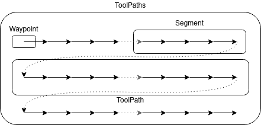
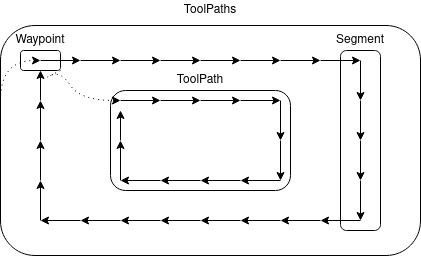
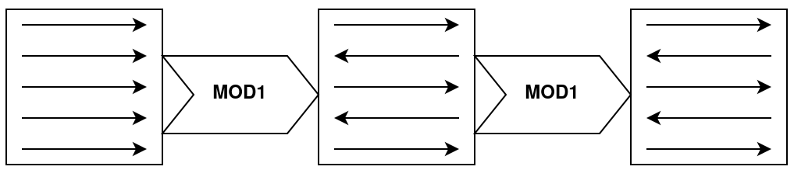
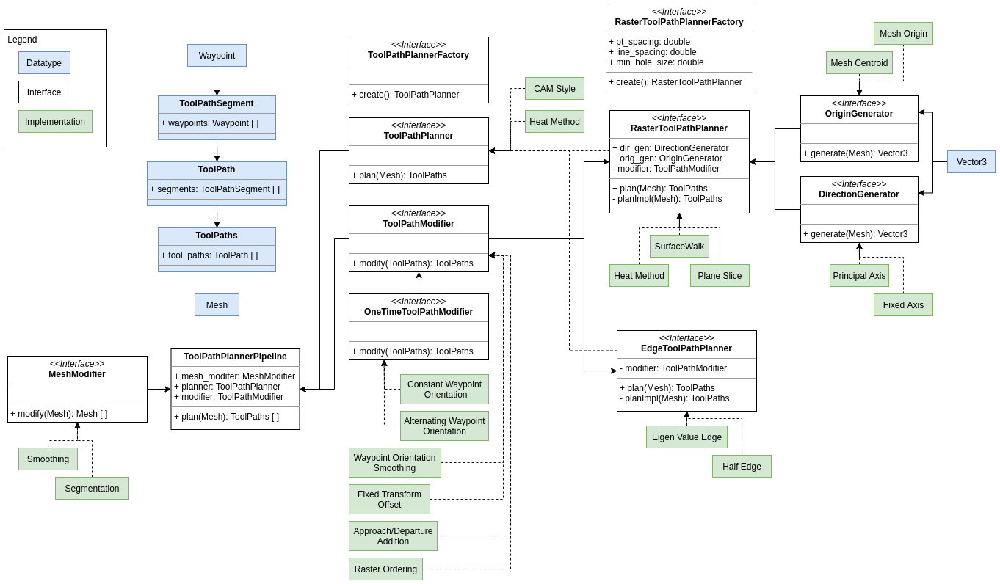

# Noether TPP
This package is a work-in-progress refactoring of the tool path planning and manipulation capabilities of Noether.  Over time, most of the functionality in tool_path_planner and path_sequence_planner will find its way into this package and the interfaces contained herein.

## Key Concepts, Interfaces, and Requirements
By describing the definition of raster plans, edge plans, and plan modifiers, we also create functional guidelines for what a RasterPlanner, EdgePlanner, and PlanModifier should do when implemented. These requirements should form the basis of the unit tests for each of these classes.

### Raster Plans

- Generally >1 raster
- Generally covers the whole supplied surface
- Lines are parallel
- Repeating pattern of lines
- All points lie on surface
- All points have same orientation
- Waypoints in rasters are consistently and spatially ordered
- Segments are consistently and spatially ordered in ToolPath
- ToolPaths are in order in top-level structure

### Edge Plans

- A list of closed-loop edges around parts
- Segments in sequential order in ToolPath
- ToolPaths ordered by length of closed loop, with longest first
- All loops start near some point (e.g. all in top left corner)
- All loops process in same direction

### Plan Modifier
- Takes in the output type of a tool path planner (i.e. ToolPaths)
- Outputs the output type of a tool path planner (i.e. ToolPaths)
- Thereshould be a strong preference for constructing modifiers that have no additional effect when run repeatedly. Since some modifications (such as adding an extra raster) will not meet this requirement, it will only apply to a specialized subclass, OneTimeModifier.
    - As an example: While a PlanModifier could be implemented via a function that reverses the direction of odd-indexed rasters, running that function twice would undo the desired changes. Instead, a more desirable PlanModifier might set the direction of every even-indexed raster to the direction of the zero-indexed raster, and set the direction of every odd-indexed raster to the opposite. This would result in no additional change if run multiple times.

## Architecture

